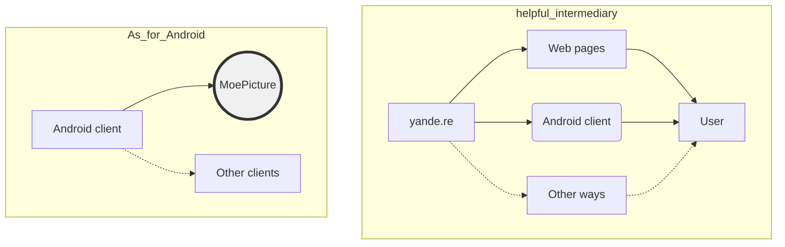

# MoePicture-Android
`jskyzero` `2017/08/18`

本项目旨在为您提供更好的获取二次元图片的解决方案。

## TODO
> TRY TO FINISH IT
### v1.0
- [x] basic home page can show home post
- [x] basic sigle picure view and logic
- [x] basic simple notification
### v1.1
- [x] search function
- [x] picture info
- [x] hamburger menu
### v1.2
- [ ] search auto complete
- [ ] setting page
- [ ] farvate tags page

## What we are

## LICENSE

GNU AFFERO GENERAL PUBLIC LICENSE Version 3